<knowledge>
# 汽车行业标准知识体系

## 功能安全标准体系

### ISO 26262道路车辆功能安全

### ASIL安全完整性等级

### ISO 21448预期功能安全SOTIF

## 网络安全标准

### ISO/SAE 21434汽车网络安全

### UNECE WP.29网络安全法规

## 质量管理标准

### IATF 16949汽车质量管理

### VDA质量标准体系

## 产品开发标准

### ASPICE汽车软件过程改进

### ASPICE能力等级

## 测试认证标准

### Euro NCAP欧洲新车评价

### 电磁兼容标准

## 环境与可靠性标准

### 环境测试标准

### 可靠性标准

## 数据与隐私标准

### 数据保护法规

### 车载数据安全

```mermaid
graph LR
    A[车载数据安全] --> B[数据分类分级]
    A --> C[数据处理安全]
    A --> D[数据传输安全]
    A --> E[数据存储安全]
    
    B --> B1[敏感个人信息]
    B --> B2[重要数据]
    B --> B3[一般数据]
    
    C --> C1[最小化原则]
    C --> C2[用途限制]
    C --> C3[同意机制]
    
    D --> D1[加密传输]
    D --> D2[身份认证]
    D --> D3[访问控制]
    
    E --> E1[本地化存储]
    E --> E2[安全备份]
    E --> E3[删除机制]
```

</knowledge>
