<knowledge>
# 域控制器技术知识体系

## 域控制器架构概念

### 域控制器定义与分类
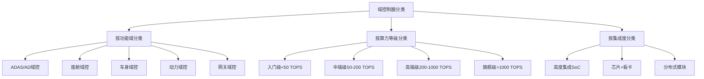

### ADAS域控制器核心功能
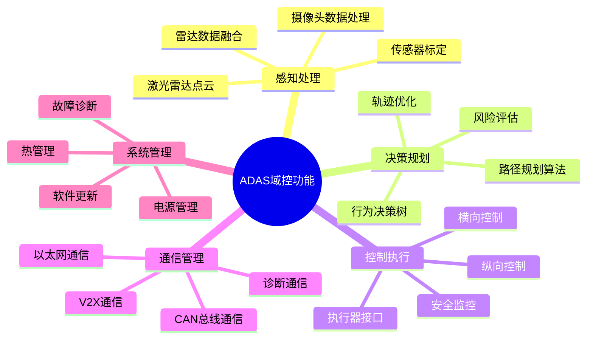

## 硬件架构设计

### 主控芯片技术对比
| 芯片厂商 | 产品型号 | 工艺制程 | AI算力 | CPU核心 | 功耗 | 适用场景 |
|----------|----------|----------|--------|---------|------|----------|
| NVIDIA | Orin X | 7nm | 254 TOPS | 12核A78 | 60W | 高端L3+ |
| 高通 | SA8295P | 5nm | 319 TOPS | 8核Kryo | 30W | 中高端L2+ |
| 地平线 | 征程5 | 16nm | 128 TOPS | 4核A55 | 8W | 中端L2+ |
| 黑芝麻 | A1000 Pro | 16nm | 196 TOPS | 8核A55 | 25W | 中端L2+ |
| TI | TDA4VM | 28nm | 8 TOPS | 2核A72 | 12W | 入门L2 |

### 存储系统设计
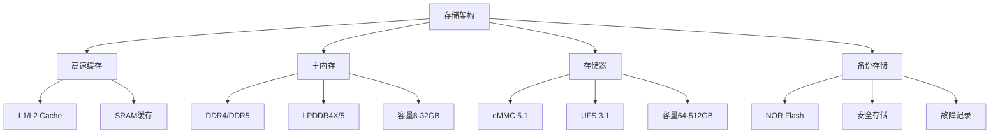

### 接口设计规范
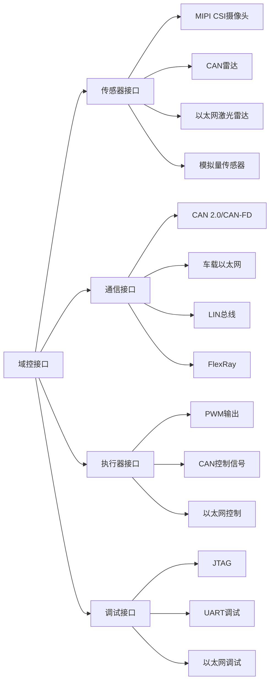

## 软件架构设计

### 操作系统选型
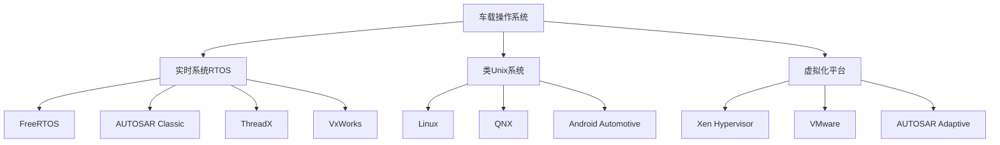

### 中间件架构
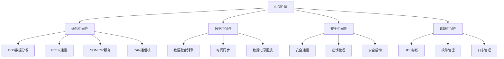

### 算法软件栈
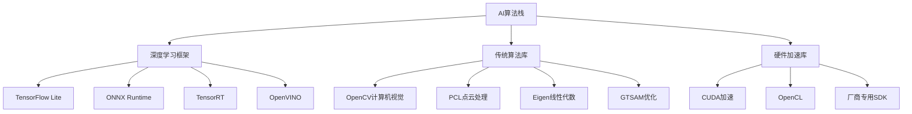

## 系统集成与测试

### 硬件在环测试HIL
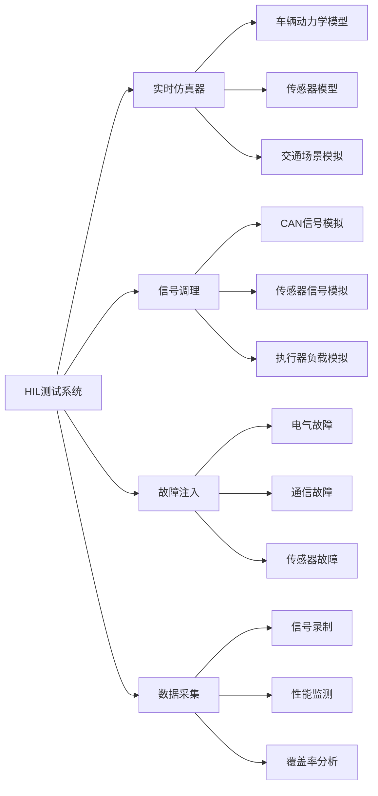

### 软件集成测试
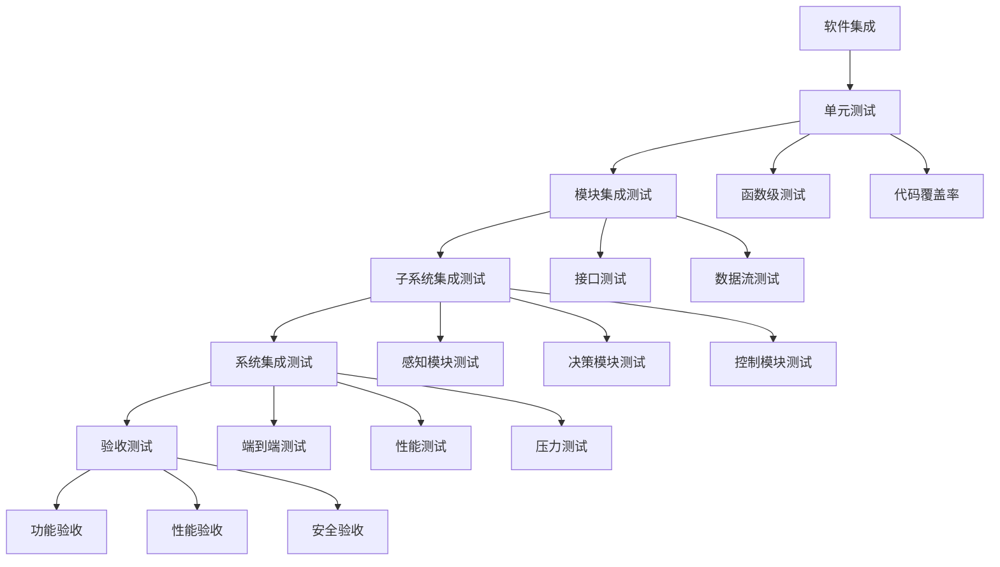

## 性能优化技术

### 计算性能优化
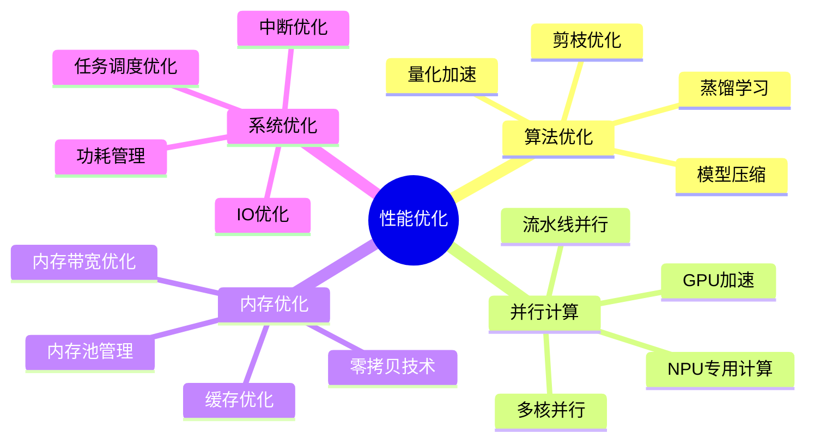

### 实时性能保证
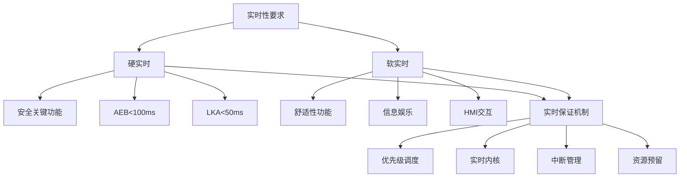

## 产业化关键技术

### 量产工程化
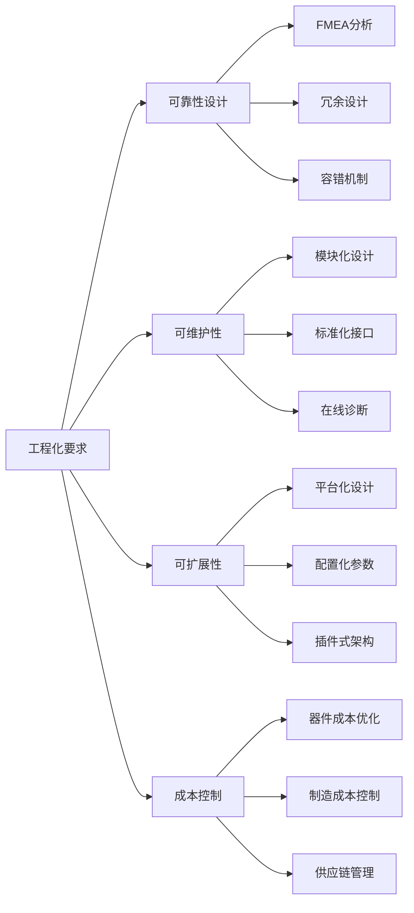

### 供应链生态
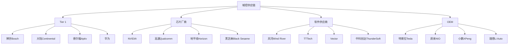
</knowledge>
