<knowledge>
# 智能驾驶技术知识体系

## 自动驾驶等级与功能定义

### SAE自动驾驶等级标准
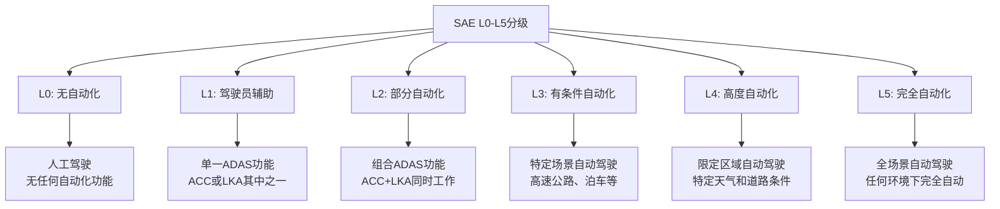

### 核心ADAS功能详解

**感知类功能：**
- **AEB (自动紧急制动)**：检测前方碰撞风险，自动制动避免或减轻碰撞
- **FCW (前碰撞预警)**：通过雷达/摄像头监测前方车辆，提前预警
- **BSM (盲点监测)**：监测车辆盲区，变道时提供预警
- **DMS (驾驶员监测)**：通过摄像头监测驾驶员状态，疲劳检测

**控制类功能：**
- **ACC (自适应巡航)**：自动保持车速和跟车距离
- **LKA (车道保持辅助)**：检测车道线，辅助保持车辆在车道内
- **LCC (车道居中控制)**：更精确的车道居中行驶控制
- **APA (自动泊车辅助)**：自动识别车位并完成泊车动作

## 智能驾驶系统架构

### 感知融合架构
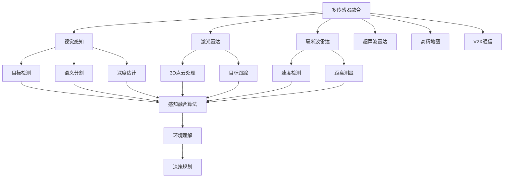

### 计算架构演进
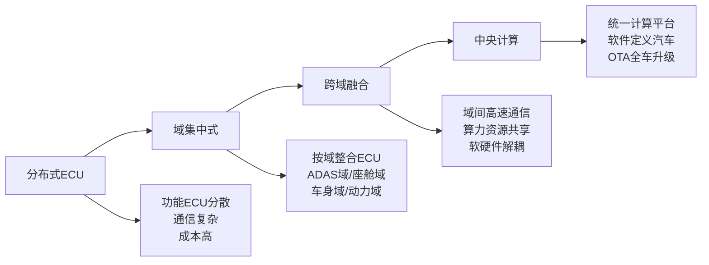

## 域控制器技术架构

### 硬件架构设计
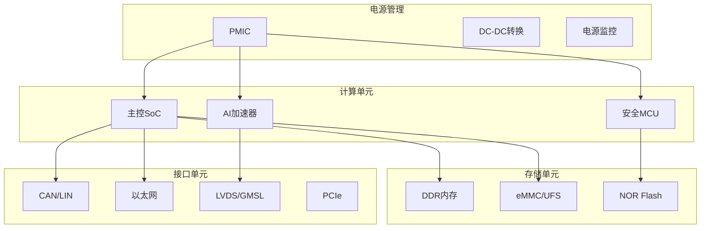

### 软件架构分层
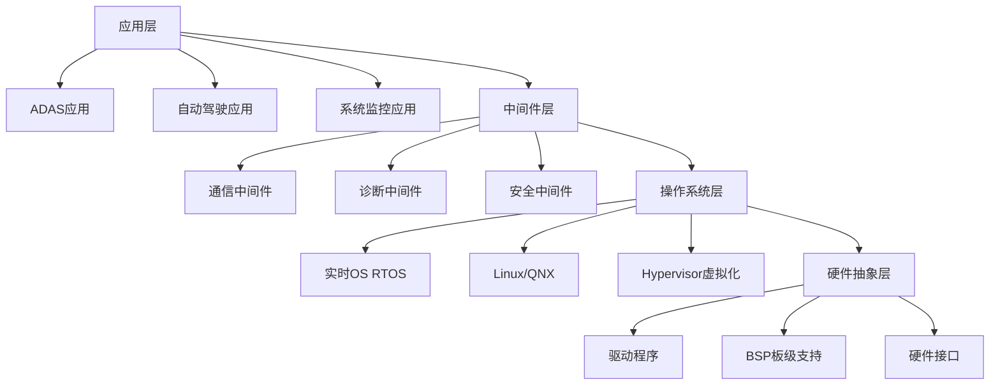

## 功能安全与信息安全

### ISO 26262功能安全体系
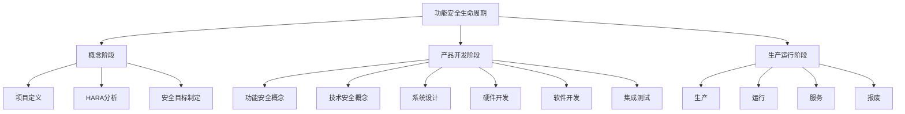

### 信息安全架构
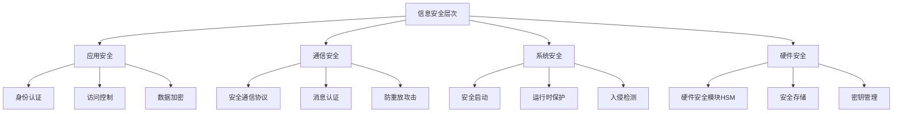

## 测试验证体系

### V模型测试流程
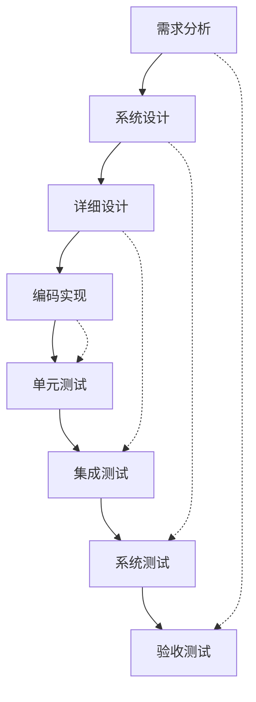

### 测试场景分类
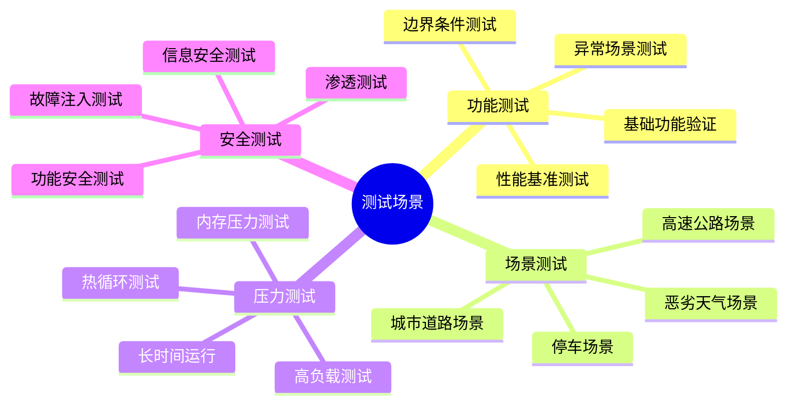

## 行业标准与法规

### 主要国际标准
- **ISO 26262**: 道路车辆功能安全标准
- **ISO 21448 (SOTIF)**: 预期功能安全标准
- **ISO/SAE 21434**: 汽车网络安全标准
- **ISO 26262**: 自动驾驶系统安全评估
- **IEEE 2857**: 自动驾驶系统设计标准

### 测试认证要求
- **Euro NCAP**: 欧洲新车评价规程
- **C-NCAP**: 中国新车评价规程
- **IIHS**: 美国公路安全保险协会测试
- **NHTSA**: 美国国家公路交通安全管理局认证

## 技术发展趋势

### 算法发展方向
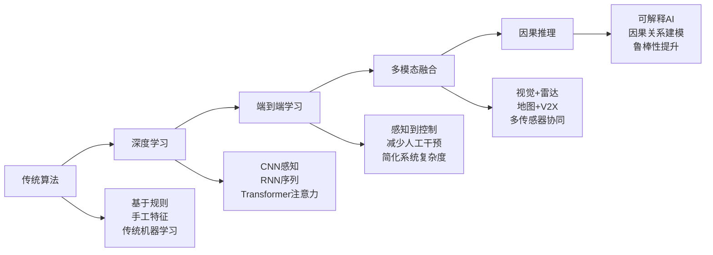

### 计算平台演进
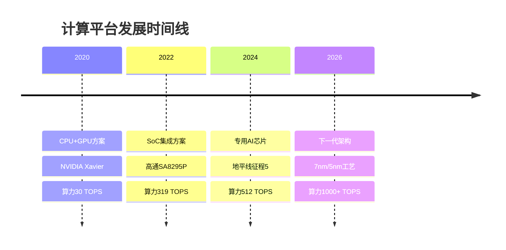
</knowledge>
