<knowledge>
# 半导体芯片技术知识体系

## 车载芯片分类与架构

### 车载芯片生态图谱
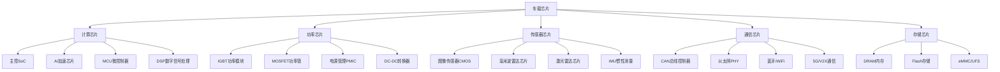

### 主控SoC芯片架构
```mermaid
graph TB
    A[SoC系统级芯片] --> B[CPU集群]
    A --> C[GPU图形处理]
    A --> D[AI加速器]
    A --> E[ISP图像处理]
    A --> F[VPU视频处理]
    A --> G[安全模块]
    A --> H[接口控制器]
    
    B --> B1[ARM Cortex-A78]
    B --> B2[ARM Cortex-R52]
    B --> B3[ARM Cortex-M7]
    
    C --> C1[Mali GPU]
    C --> C2[Adreno GPU]
    C --> C3[PowerVR GPU]
    
    D --> D1[NPU神经网络]
    D --> D2[DSP专用加速]
    D --> D3[AI引擎]
    
    E --> E1[多摄像头支持]
    E --> E2[HDR处理]
    E --> E3[降噪算法]
    
    F --> F1[H.264/H.265编解码]
    F --> F2[多路视频处理]
    
    G --> G1[安全启动]
    G --> G2[硬件加密]
    G --> G3[密钥存储]
    
    H --> H1[PCIe控制器]
    H --> H2[USB控制器]
    H --> H3[以太网MAC]
    H --> H4[CAN控制器]
```

## 主流芯片厂商技术对比

### 国际主流厂商
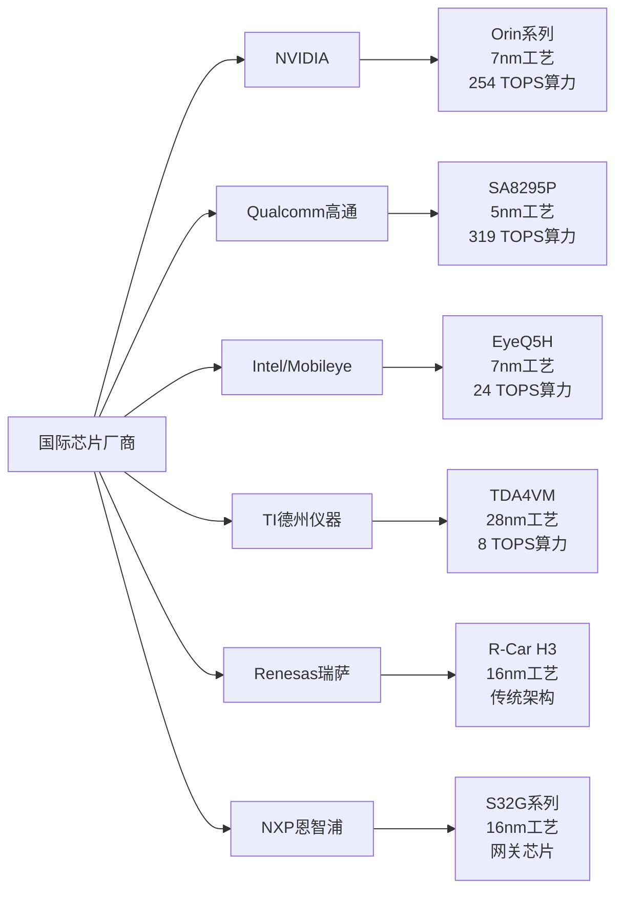

### 国产芯片厂商
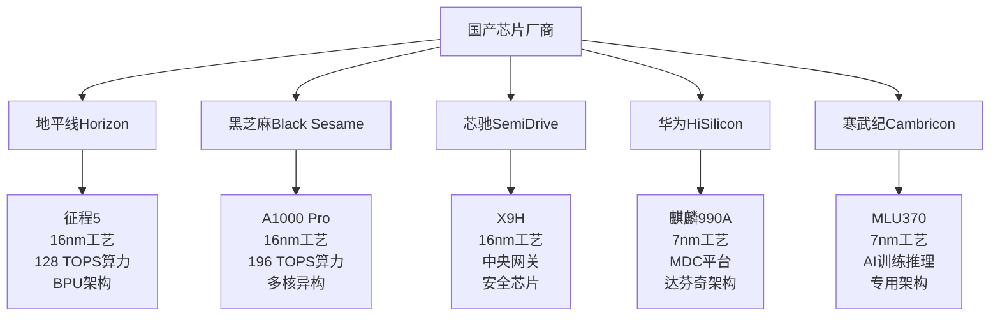

## 车规级芯片标准

### AEC-Q100车规认证
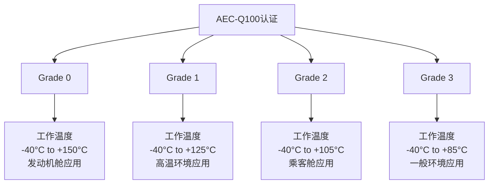

### 车规级可靠性要求
| 测试项目 | 标准要求 | 测试条件 | 目标指标 |
|----------|----------|----------|----------|
| 高温运行寿命 | HTOL | 150°C, 1000小时 | FIT<10 |
| 温度循环 | TC | -40°C~150°C, 1000次 | 无失效 |
| 湿热偏置 | THB | 85°C/85%RH, 1000小时 | 无失效 |
| 电迁移 | EM | 125°C, 电流密度测试 | 寿命>15年 |
| 锡须测试 | Whisker | 高温高湿环境 | 无锡须生长 |
| ESD静电 | HBM/CDM | 人体/器件模型 | >2kV/500V |

## AI芯片架构技术

### AI计算架构对比
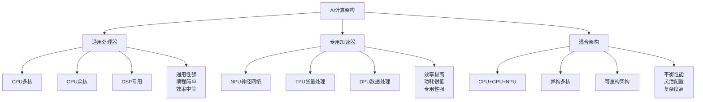

### 神经网络加速技术
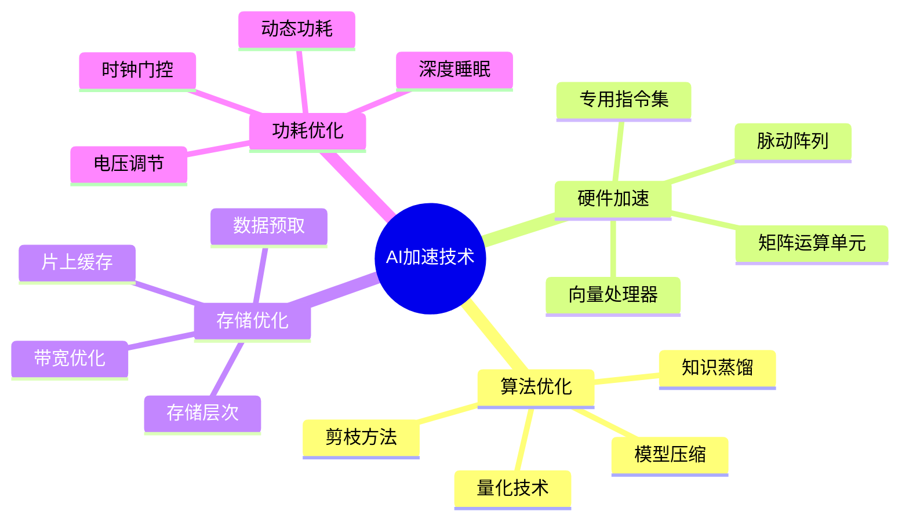

## 芯片制造工艺

### 先进制程工艺
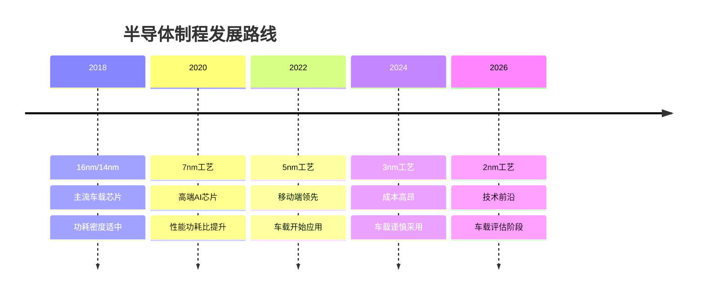

### 工艺技术对比
| 工艺节点 | 晶体管密度 | 功耗特性 | 成本水平 | 车载应用 |
|----------|------------|----------|----------|----------|
| 28nm | 基准 | 基准 | 低 | 广泛应用 |
| 16nm | 2x | -40% | 中等 | 主流应用 |
| 7nm | 3.3x | -60% | 高 | 高端应用 |
| 5nm | 5x | -75% | 很高 | 评估中 |
| 3nm | 8x | -85% | 极高 | 研究中 |

## 芯片供应链管理

### 全球供应链格局
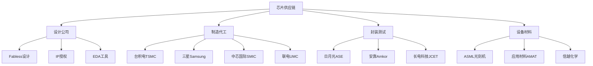

### 车载芯片供应风险
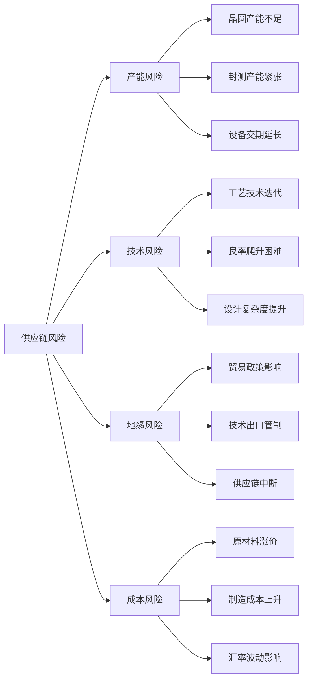

## 芯片测试与验证

### 芯片测试流程
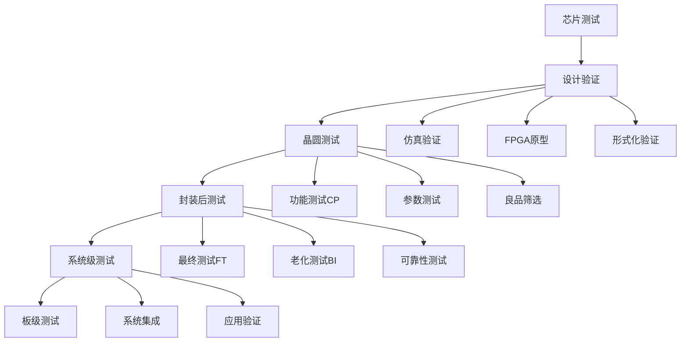

### 车规级测试要求
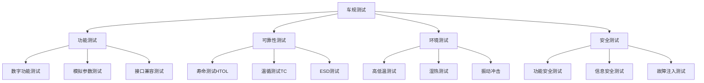
</knowledge>
