# UDS协议实战：智能驾驶域控制器诊断与数据通信深度解析

## 引言：智能驾驶时代的ECU诊断新挑战

在智能驾驶车辆高度复杂的电子架构中，域控制器作为核心计算节点，集成了感知、决策、控制等关键功能。然而，随着自动驾驶等级的提升，域控制器的复杂度呈指数级增长，传统的诊断手段已无法满足其深度诊断需求。如何高效、精准地获取域控制器状态、定位故障，乃至进行远程升级和维护，成为智能驾驶系统稳定运行的关键。

**UDS（Unified Diagnostic Services）协议**作为ISO 14229-1国际标准定义的诊断通信协议，为这一挑战提供了完整的解决方案。它不仅是智能驾驶域控制器开发、测试、生产和售后维护的"诊断之眼"，更是连接控制器与外部世界进行数据交互的"标准化门户"。

本文将从智能驾驶域控制器的实际应用角度，深度解析UDS协议的核心服务，揭示如何利用UDS实现高效的控制器诊断与数据通信。

## 一、UDS协议架构：域控制器诊断的"统一语言"

### 1.1 UDS协议在智能驾驶系统中的定位

UDS（Unified Diagnostic Services）是ISO 14229-1国际标准规定的汽车电子控制单元（ECU）诊断协议。在智能驾驶域控制器架构中，UDS协议位于通信协议栈的关键位置：

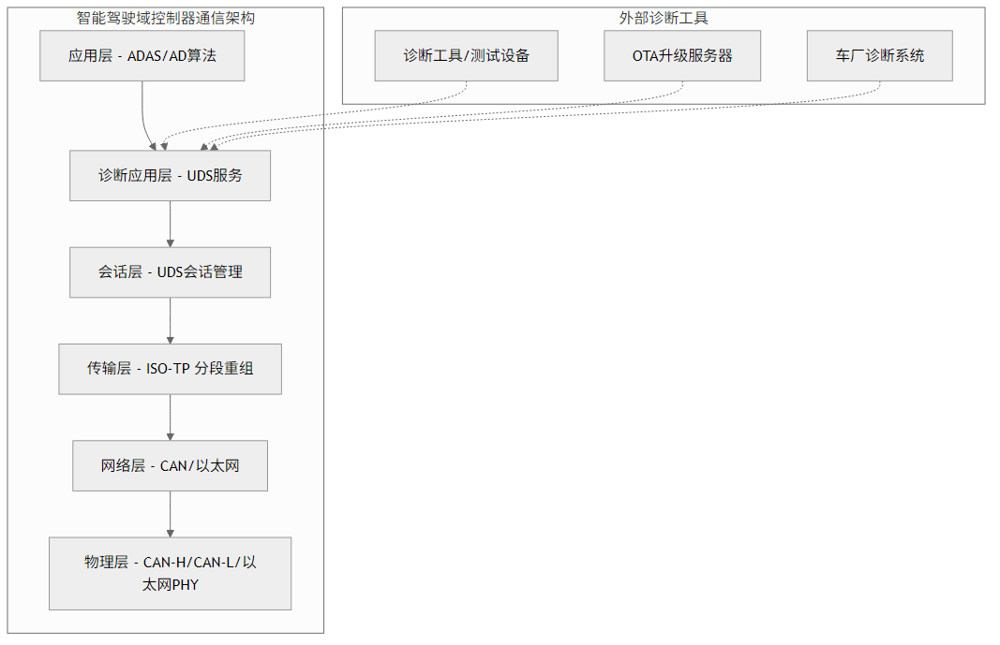

*图1-1：智能驾驶域控制器通信架构 - 展示UDS协议在通信协议栈中的关键位置*

上图展示了UDS协议在智能驾驶域控制器通信架构中的核心地位。UDS服务位于诊断应用层，通过标准化的接口与外部诊断工具、OTA升级服务器和车厂诊断系统进行通信，为智能驾驶系统提供统一的诊断和数据交互能力。

### 1.2 UDS通信机制

UDS通信遵循**Client-Server模式**：诊断工具（Client）发送服务请求，域控制器（Server）处理后返回响应。每个UDS服务都有唯一的**服务标识符（SID）**。

下图展示了UDS请求-响应通信的基本流程，诊断工具发送包含SID、子功能和数据的请求，域控制器根据处理结果返回肯定响应（SID+0x40）或否定响应（0x7F+原SID+错误码）。

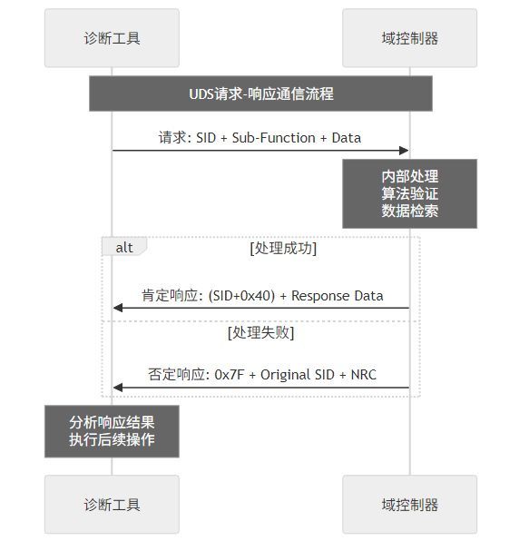

*图1-2：UDS请求-响应通信流程 - 展示Client-Server模式的通信机制*

## 二、UDS核心诊断服务在智能驾驶中的深度应用

### 2.1 诊断与通信管理服务

#### 2.1.1 诊断会话控制 (SID: 0x10)

诊断会话控制是UDS协议的核心服务，决定了域控制器当前可访问的功能范围：

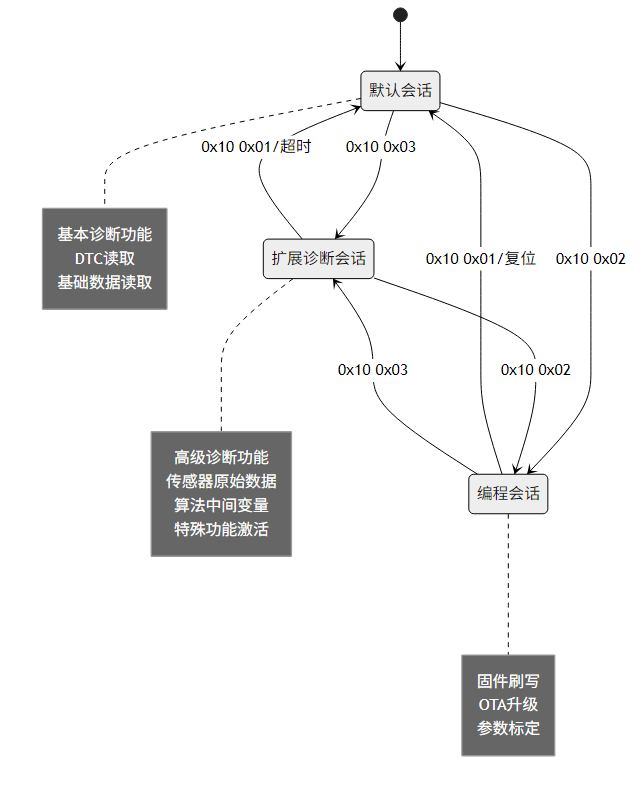

*图2-1：诊断会话控制状态图 - 展示三种会话模式的转换关系和功能特点*

**智能驾驶应用场景：**

- **默认会话 (0x01)**：车辆正常运行时的诊断模式
  - 读取基础故障码
  - 获取系统版本信息
  - 监控基本运行状态

- **扩展诊断会话 (0x03)**：开发测试和深度诊断
  - 读取传感器原始数据（摄像头图像、雷达点云、激光雷达距离）
  - 获取算法中间变量（目标检测置信度、路径规划参数）
  - 激活特殊测试功能（传感器校准、算法debug模式）

- **编程会话 (0x02)**：OTA升级和参数标定
  - 域控制器固件升级
  - 算法模型更新
  - 传感器标定参数写入

#### 2.1.2 ECU复位控制 (SID: 0x11)

下图显示了UDS复位服务的两种主要类型及其在域控制器中的具体执行流程。硬复位模拟完全断电重启，需要重新初始化所有硬件和软件组件；软复位仅重启软件层面，保持硬件状态不变，适用于算法模块的快速恢复。

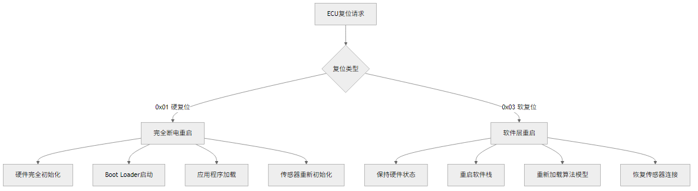

*图2-2：ECU复位控制流程 - 对比硬复位和软复位的执行流程*

**智能驾驶应用场景：**
- **硬复位**：验证域控制器冷启动性能，测试自动驾驶系统的启动时间
- **软复位**：算法模块异常后快速恢复，避免影响其他功能模块

#### 2.1.3 安全访问控制 (SID: 0x27 & 0x29)

以下流程图展示了UDS安全访问的Seed-Key认证机制，域控制器内置的硬件安全模块负责生成随机Seed值和验证Key值，确保只有获得授权密钥算法的诊断工具才能访问高级功能。

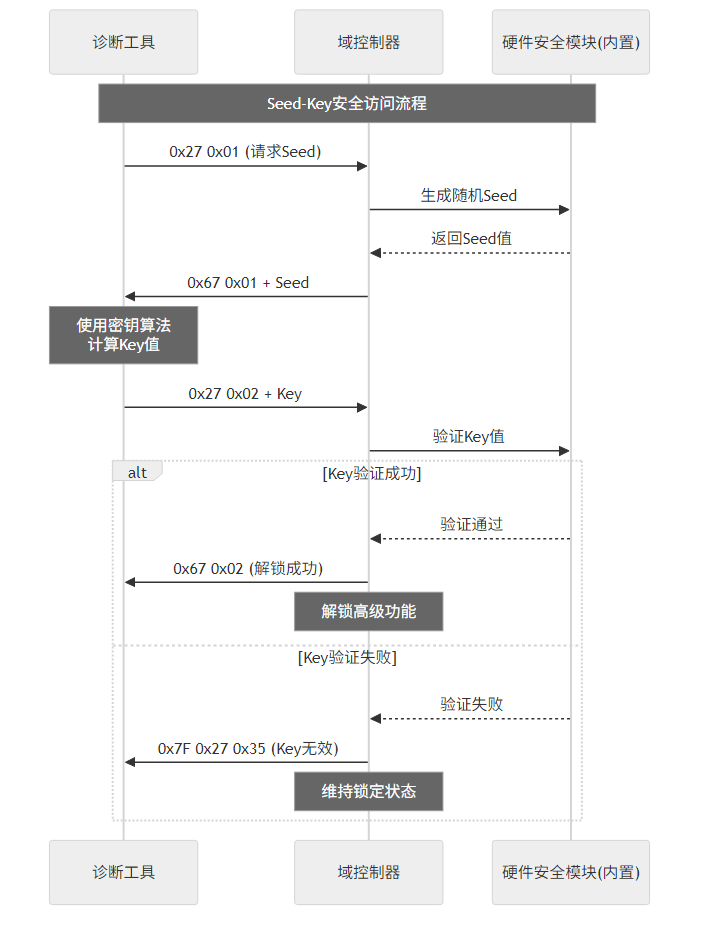

*图2-3：Seed-Key安全访问流程 - 展示完整的安全认证交互过程*

### 2.2 数据传输服务

#### 2.2.1 数据标识符读取 (SID: 0x22)

下图展示了UDS数据读取服务的DID分类体系，从系统信息、传感器数据、算法状态到诊断数据的完整层次结构，每种DID都有特定的应用场景和数据格式。

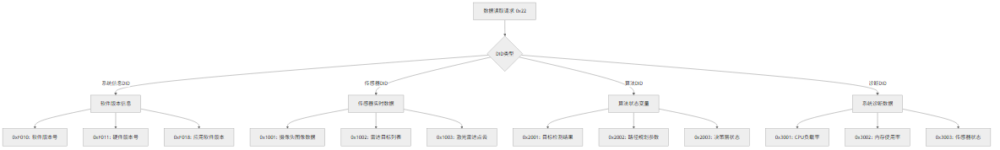

*图2-4：数据标识符读取分类 - 展示DID分类体系和典型应用场景*

#### 2.2.2 数据标识符写入 (SID: 0x2E)

**智能驾驶域控制器典型写入场景：**

下图展示了UDS数据写入服务在智能驾驶域控制器中的三大应用领域：传感器标定参数的精确写入、算法配置参数的动态调整，以及各种ADAS功能的使能控制。

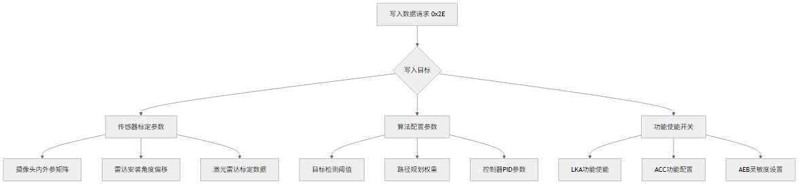

*图2-5：数据标识符写入应用 - 展示三大写入应用领域*

### 2.3 故障码诊断服务

#### 2.3.1 DTC信息读取 (SID: 0x19)

下图展示了符合ISO 14229标准的UDS DTC读取服务架构。左侧显示了0x19服务的主要子功能，右侧展示了智能驾驶域控制器中典型的DTC分类体系，包括传感器故障、算法异常和通信故障等类别。

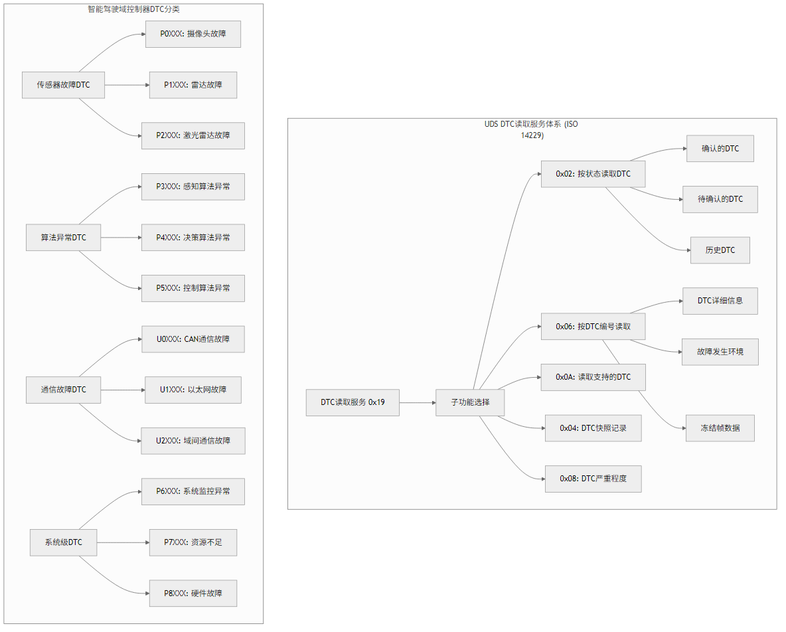

*图2-6：DTC读取服务架构 - 展示UDS DTC服务体系和智能驾驶DTC分类*

#### 2.3.2 完整诊断流程示例

下图展示了智能驾驶域控制器的典型诊断流程，从建立扩展诊断会话开始，通过TesterPresent保持连接，依次进行系统信息读取、故障码诊断、实时数据获取和传感器自检，最后通过硬复位结束诊断流程。

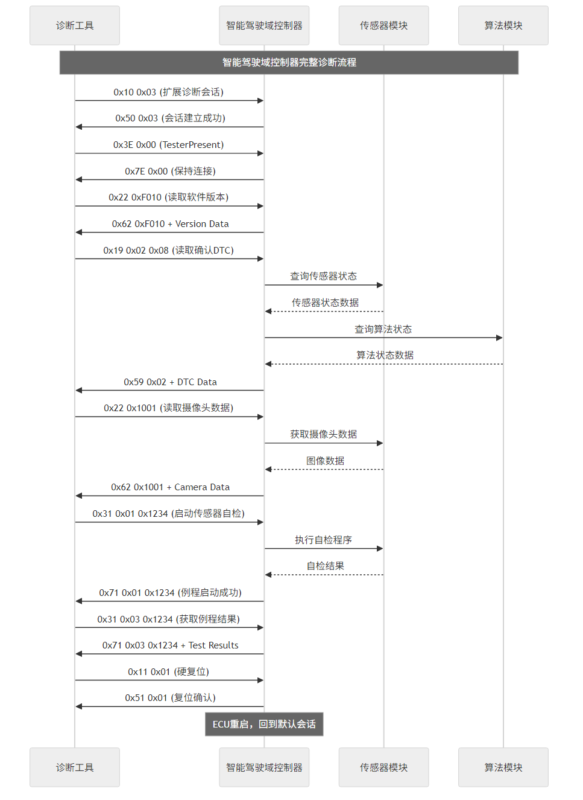

*图2-7：完整诊断流程示例 - 展示从建立会话到复位结束的完整诊断过程*

### 2.4 远程例程控制服务

#### 2.4.1 例程控制 (SID: 0x31)

下图展示了UDS例程控制服务的三种子功能及其在智能驾驶域控制器中的具体应用。例程控制允许远程启动复杂的测试序列，从传感器标定到算法性能测试，再到系统级自检程序的全面覆盖。

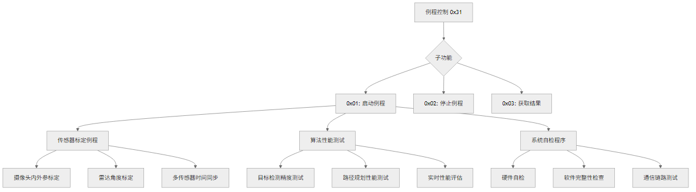

*图2-8：例程控制服务 - 展示例程控制的子功能和应用场景*

## 三、UDS在智能驾驶域控制器全生命周期中的应用

### 3.1 开发阶段应用

下图展示了智能驾驶域控制器在产品开发各阶段中UDS协议的具体应用，从需求分析阶段的UDS服务定义，到性能优化阶段的诊断功能调优，UDS贯穿整个开发生命周期。

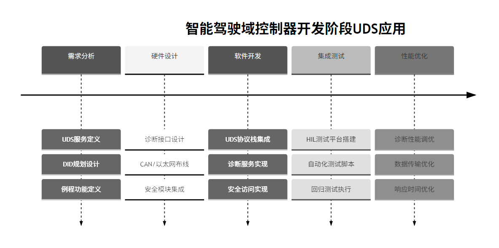

*图3-1：开发阶段UDS应用时间线 - 展示产品开发各阶段的UDS应用重点*

### 3.2 生产制造阶段

下图展示了生产线上UDS协议在EOL（End of Line）下线检测中的完整应用流程，从固件刷写到最终的故障注入测试，确保每台域控制器出厂前的功能完整性和质量可靠性。

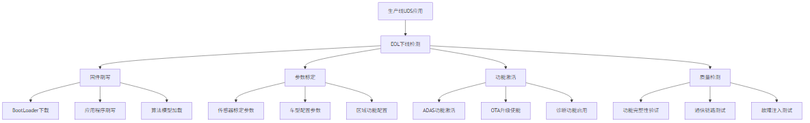

*图3-2：生产制造阶段流程 - 展示EOL下线检测的完整UDS应用流程*

### 3.3 售后服务阶段

下图展示了售后服务中UDS协议的两大应用场景：传统的车辆进厂诊断流程和现代的远程OTA升级服务。左侧显示了从故障检测到维修验证的完整售后诊断链条，右侧展示了从安全认证到系统验证的OTA升级全流程。

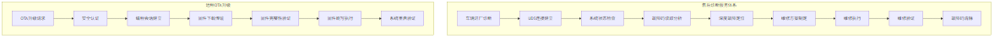

*图3-3：售后服务应用场景 - 展示传统诊断和OTA升级两大服务场景*

## 四、UDS协议实施的技术要点与注意事项

### 4.1 功能安全考虑

在智能驾驶域控制器中实施UDS协议时，必须考虑功能安全要求：

下图展示了UDS功能安全设计的四个核心维度，从诊断通信的完整性保护，到安全访问的多重控制，再到故障检测的实时监控和安全状态的动态管理，构建了完整的UDS安全防护体系。

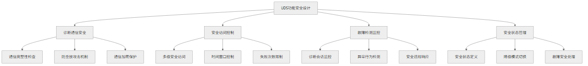

*图4-1：UDS功能安全设计 - 展示功能安全的四个核心维度*

### 4.2 性能优化策略

下图以思维导图的形式展示了UDS性能优化的四大策略领域，涵盖通信效率提升、响应时间优化、系统资源管理和错误处理机制的全面优化方案。

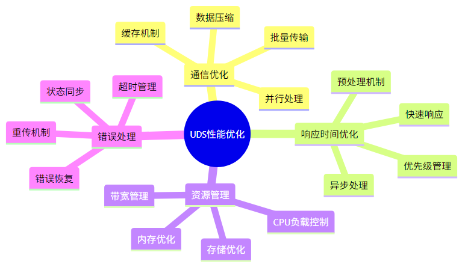

*图4-2：UDS性能优化策略 - 展示四大性能优化策略领域*

### 4.3 标准化与兼容性

下图展示了UDS协议标准化实施的四个关键维度，从严格遵循ISO 14229国际标准，到满足OEM厂商的特殊需求，再到确保主流诊断工具的兼容性和未来技术的可扩展性。

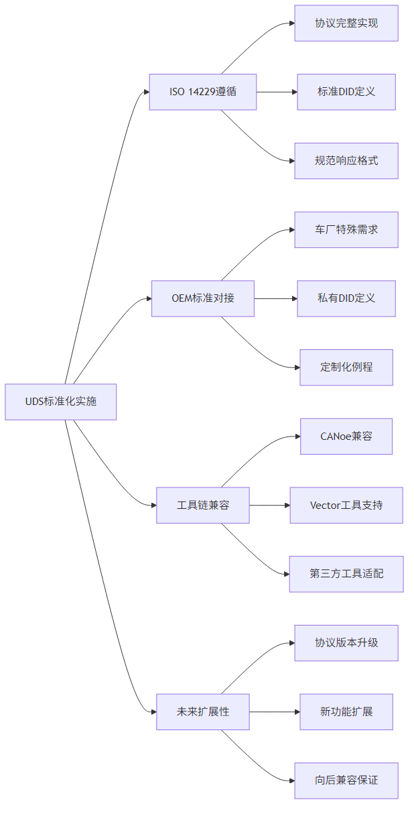

*图4-3：标准化与兼容性实施 - 展示标准化实施的四个关键维度*

## 五、总结与展望

UDS协议作为智能驾驶域控制器的"数字神经系统"，在整个产品生命周期中发挥着关键作用：

### 5.1 核心价值总结

1. **标准化诊断接口**：提供统一的诊断通信标准，降低开发和维护成本
2. **深度故障诊断**：支持从系统级到算法级的全方位故障诊断
3. **高效数据交互**：实现实时数据读取、参数配置和远程控制
4. **安全可靠通信**：内置安全机制，保障诊断通信的安全性
5. **全生命周期支持**：覆盖开发、生产、售后的完整应用场景

### 5.2 未来发展趋势

下图以时间线的形式展示了UDS协议在智能驾驶领域的发展演进路径，从当前基于CAN的传统应用，逐步向5G网络、AI辅助和数字孪生等前沿技术领域扩展。

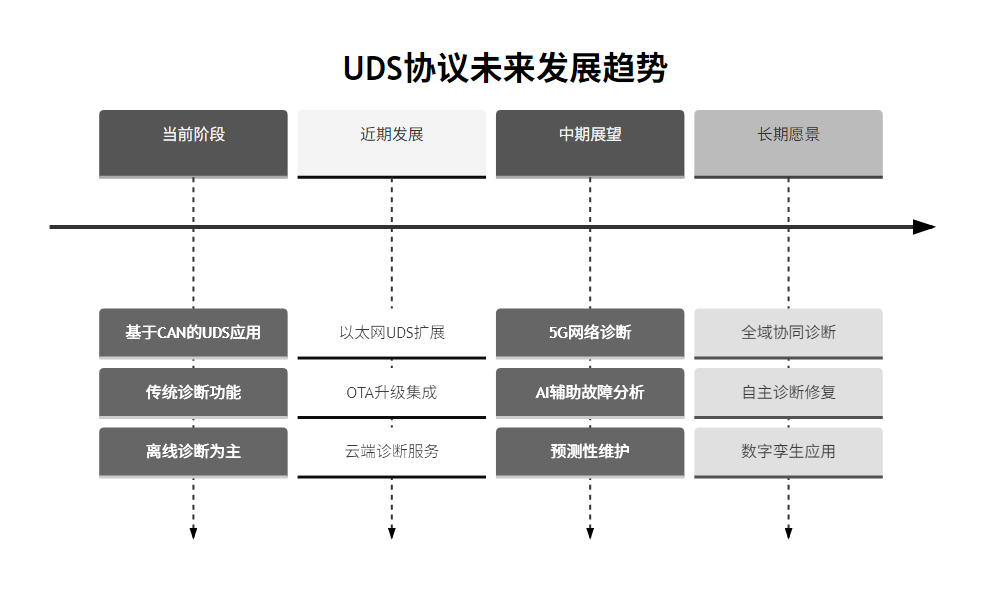

*图5-1：UDS协议未来发展趋势 - 展示从当前到长期的技术发展路径*

随着智能驾驶技术的不断发展，UDS协议也将持续演进，为更复杂的域控制器系统提供更强大的诊断和通信能力。掌握UDS协议的深度应用，将是智能驾驶系统工程师的核心竞争力之一。

### 5.3 实施建议

基于本文的深度分析，我们提出以下UDS协议实施建议：

#### 技术实施层面
1. **严格遵循ISO 14229标准**：确保协议实现的标准化和互操作性
2. **重视功能安全设计**：在诊断功能中嵌入安全机制，防范潜在风险
3. **优化性能表现**：通过多维度优化策略提升诊断效率和用户体验
4. **确保工具链兼容**：支持主流诊断工具，降低使用门槛

#### 项目管理层面
1. **全生命周期规划**：从需求分析阶段开始就考虑UDS诊断需求
2. **跨部门协作**：建立开发、测试、生产、售后的协作机制
3. **持续迭代优化**：根据实际应用反馈不断改进诊断策略
4. **人才培养**：培养UDS专业技术人才，提升团队核心竞争力

#### 未来发展准备
1. **技术储备**：关注以太网UDS、5G诊断等新技术发展
2. **生态建设**：与产业链上下游建立良好的合作关系
3. **标准参与**：积极参与相关国际标准的制定和修订
4. **创新探索**：探索AI辅助诊断、预测性维护等前沿应用

## 附录

### 附录A：UDS服务标识符(SID)快速参考表

| 服务类别 | SID | 服务名称 | 主要功能 |
|----------|-----|----------|----------|
| **诊断与通信管理** | 0x10 | 诊断会话控制 | 切换诊断会话模式 |
| | 0x11 | ECU复位 | 硬复位/软复位控制 |
| | 0x27 | 安全访问 | Seed-Key认证 |
| | 0x28 | 通信控制 | 控制网络通信 |
| | 0x3E | TesterPresent | 保持诊断会话 |
| **数据传输服务** | 0x22 | 数据标识符读取 | 读取指定DID数据 |
| | 0x23 | 内存地址读取 | 读取指定内存地址 |
| | 0x2E | 数据标识符写入 | 写入指定DID数据 |
| | 0x3D | 内存地址写入 | 写入指定内存地址 |
| **存储数据传输** | 0x34 | 请求下载 | 初始化数据下载 |
| | 0x35 | 请求上传 | 初始化数据上传 |
| | 0x36 | 传输数据 | 执行数据传输 |
| | 0x37 | 请求传输退出 | 结束数据传输 |
| **故障码服务** | 0x19 | 读取DTC信息 | 读取故障码相关信息 |
| | 0x14 | 清除DTC信息 | 清除故障码 |
| **例程控制** | 0x31 | 例程控制 | 启动/停止/获取例程结果 |

### 附录B：智能驾驶域控制器典型DID定义

| DID范围 | 用途 | 典型示例 |
|---------|------|----------|
| **0xF000-0xF0FF** | 系统信息 | 软件版本、硬件版本、序列号 |
| **0xF100-0xF1FF** | 车辆信息 | VIN码、车型代码、生产日期 |
| **0x1000-0x1FFF** | 传感器数据 | 摄像头、雷达、激光雷达数据 |
| **0x2000-0x2FFF** | 算法状态 | 感知、决策、控制算法参数 |
| **0x3000-0x3FFF** | 系统监控 | CPU、内存、温度、电压 |
| **0x4000-0x4FFF** | 配置参数 | 功能使能、标定参数 |

### 附录C：参考文献与标准

1. **ISO 14229-1:2020** - Road vehicles — Unified diagnostic services (UDS) — Part 1: Application layer
2. **ISO 14229-2:2016** - Road vehicles — Unified diagnostic services (UDS) — Part 2: Session layer services
3. **ISO 15765-2:2016** - Road vehicles — Diagnostic communication over Controller Area Network (DoCAN) — Part 2: Transport protocol and network layer services
4. **SAE J1979** - E/E Diagnostic Test Modes
5. **GB/T 32960** - 新能源汽车远程服务与管理系统技术规范

### 附录D：图表索引

本文档包含17个专业技术图表，所有图表的PNG版本都保存在`images/`目录下：

1. [01_uds_architecture.png](images/01_uds_architecture.png) - 智能驾驶域控制器通信架构
2. [02_uds_communication.png](images/02_uds_communication.png) - UDS请求-响应通信流程
3. [03_session_control.png](images/03_session_control.png) - 诊断会话控制状态图
4. [04_ecu_reset.png](images/04_ecu_reset.png) - ECU复位控制流程
5. [05_security_access.png](images/05_security_access.png) - Seed-Key安全访问流程
6. [06_data_identifier_read.png](images/06_data_identifier_read.png) - 数据标识符读取分类
7. [07_data_identifier_write.png](images/07_data_identifier_write.png) - 数据标识符写入应用
8. [08_dtc_service.png](images/08_dtc_service.png) - DTC读取服务架构
9. [09_complete_diagnostic_flow.png](images/09_complete_diagnostic_flow.png) - 完整诊断流程示例
10. [10_routine_control.png](images/10_routine_control.png) - 例程控制服务
11. [11_development_timeline.png](images/11_development_timeline.png) - 开发阶段UDS应用时间线
12. [12_production_flow.png](images/12_production_flow.png) - 生产制造阶段流程
13. [13_aftermarket_service.png](images/13_aftermarket_service.png) - 售后服务应用场景
14. [14_functional_safety.png](images/14_functional_safety.png) - UDS功能安全设计
15. [15_performance_optimization.png](images/15_performance_optimization.png) - UDS性能优化策略
16. [16_standardization.png](images/16_standardization.png) - 标准化与兼容性实施
17. [17_future_trends.png](images/17_future_trends.png) - UDS协议未来发展趋势

---

**关于作者**

本文档由专业的汽车电子和智能驾驶技术团队撰写，结合多年的UDS协议实施经验和智能驾驶项目实践，旨在为相关工程师和研发人员提供实用的技术指导。

**版权说明**

本文档及其图表可用于学习、研究和技术交流。商业使用请遵循相关版权规定。

**联系方式**

如有技术问题或改进建议，欢迎通过以下方式联系：
- 技术交流邮箱：uds-protocol@example.com
- 项目GitHub：https://github.com/example/uds-protocol-guide

---

*本文从智能驾驶域控制器的实际应用角度深度解析了UDS协议，包含17个专业技术图表和完整的实施指导。随着智能驾驶技术的快速发展，UDS协议的应用场景和技术要求也将不断升级，需要我们持续关注和学习。*
