# UDS协议实战：智能驾驶域控制器诊断与数据通信深度解析

## 引言：智能驾驶时代的ECU诊断新挑战

在智能驾驶车辆高度复杂的电子架构中，域控制器作为核心计算节点，集成了感知、决策、控制等关键功能。然而，随着自动驾驶等级的提升，域控制器的复杂度呈指数级增长，传统的诊断手段已无法满足其深度诊断需求。如何高效、精准地获取域控制器状态、定位故障，乃至进行远程升级和维护，成为智能驾驶系统稳定运行的关键。

**UDS（Unified Diagnostic Services）协议**作为ISO 14229-1国际标准定义的诊断通信协议，为这一挑战提供了完整的解决方案。它不仅是智能驾驶域控制器开发、测试、生产和售后维护的"诊断之眼"，更是连接控制器与外部世界进行数据交互的"标准化门户"。

本文将从智能驾驶域控制器的实际应用角度，深度解析UDS协议的核心服务，揭示如何利用UDS实现高效的控制器诊断与数据通信。

## 一、UDS协议架构：域控制器诊断的"统一语言"

### 1.1 UDS协议在智能驾驶系统中的定位

UDS（Unified Diagnostic Services）是ISO 14229-1国际标准规定的汽车电子控制单元（ECU）诊断协议。在智能驾驶域控制器架构中，UDS协议位于通信协议栈的关键位置：

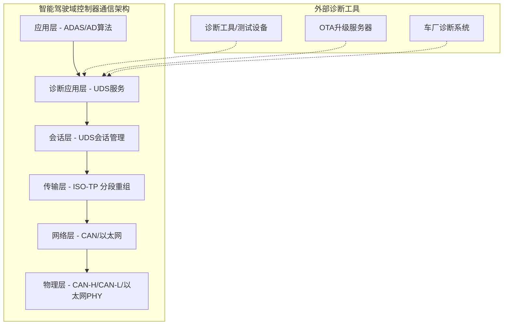

### 1.2 UDS通信机制

UDS通信遵循**Client-Server模式**：诊断工具（Client）发送服务请求，域控制器（Server）处理后返回响应。每个UDS服务都有唯一的**服务标识符（SID）**。

下图展示了UDS请求-响应通信的基本流程，诊断工具发送包含SID、子功能和数据的请求，域控制器根据处理结果返回肯定响应（SID+0x40）或否定响应（0x7F+原SID+错误码）。

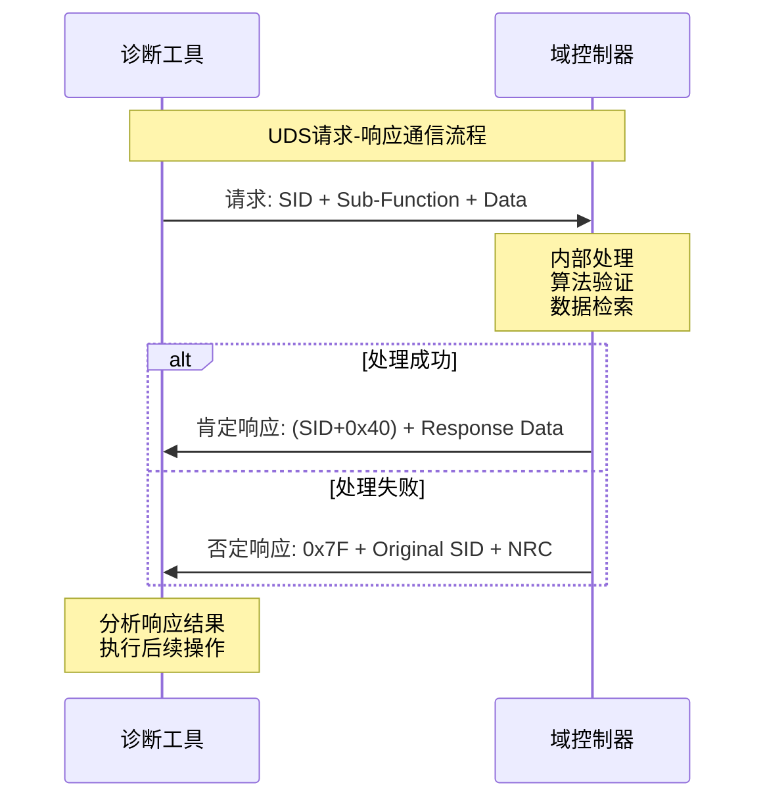

## 二、UDS核心诊断服务在智能驾驶中的深度应用

### 2.1 诊断与通信管理服务

#### 2.1.1 诊断会话控制 (SID: 0x10)

诊断会话控制是UDS协议的核心服务，决定了域控制器当前可访问的功能范围：

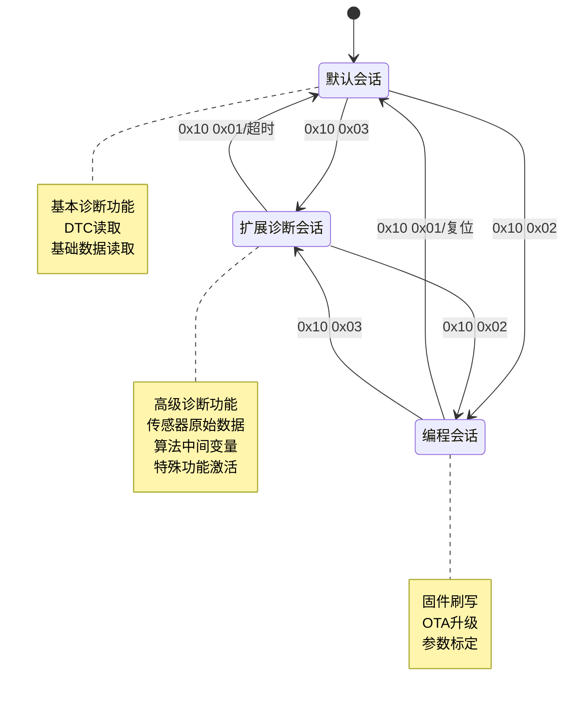

**智能驾驶应用场景：**

- **默认会话 (0x01)**：车辆正常运行时的诊断模式
  - 读取基础故障码
  - 获取系统版本信息
  - 监控基本运行状态

- **扩展诊断会话 (0x03)**：开发测试和深度诊断
  - 读取传感器原始数据（摄像头图像、雷达点云、激光雷达距离）
  - 获取算法中间变量（目标检测置信度、路径规划参数）
  - 激活特殊测试功能（传感器校准、算法debug模式）

- **编程会话 (0x02)**：OTA升级和参数标定
  - 域控制器固件升级
  - 算法模型更新
  - 传感器标定参数写入

#### 2.1.2 ECU复位控制 (SID: 0x11)

下图显示了UDS复位服务的两种主要类型及其在域控制器中的具体执行流程。硬复位模拟完全断电重启，需要重新初始化所有硬件和软件组件；软复位仅重启软件层面，保持硬件状态不变，适用于算法模块的快速恢复。

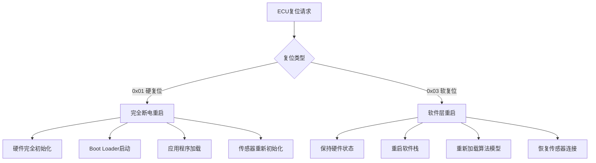

**智能驾驶应用场景：**
- **硬复位**：验证域控制器冷启动性能，测试自动驾驶系统的启动时间
- **软复位**：算法模块异常后快速恢复，避免影响其他功能模块

#### 2.1.3 安全访问控制 (SID: 0x27 & 0x29)

以下流程图展示了UDS安全访问的Seed-Key认证机制，域控制器内置的硬件安全模块负责生成随机Seed值和验证Key值，确保只有获得授权密钥算法的诊断工具才能访问高级功能。

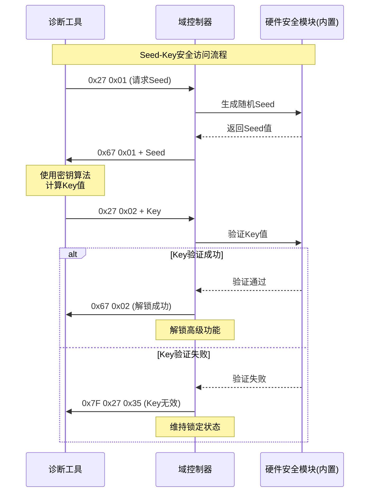

### 2.2 数据传输服务

#### 2.2.1 数据标识符读取 (SID: 0x22)

下图展示了UDS数据读取服务的DID分类体系，从系统信息、传感器数据、算法状态到诊断数据的完整层次结构，每种DID都有特定的应用场景和数据格式。

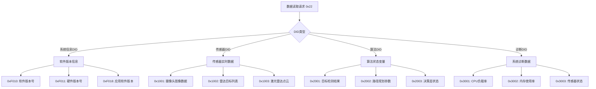

#### 2.2.2 数据标识符写入 (SID: 0x2E)

**智能驾驶域控制器典型写入场景：**

下图展示了UDS数据写入服务在智能驾驶域控制器中的三大应用领域：传感器标定参数的精确写入、算法配置参数的动态调整，以及各种ADAS功能的使能控制。

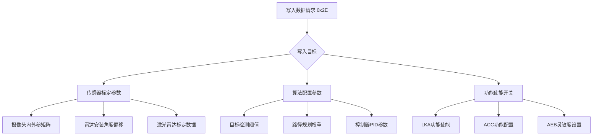

### 2.3 故障码诊断服务

#### 2.3.1 DTC信息读取 (SID: 0x19)

下图展示了符合ISO 14229标准的UDS DTC读取服务架构。左侧显示了0x19服务的主要子功能，右侧展示了智能驾驶域控制器中典型的DTC分类体系，包括传感器故障、算法异常和通信故障等类别。

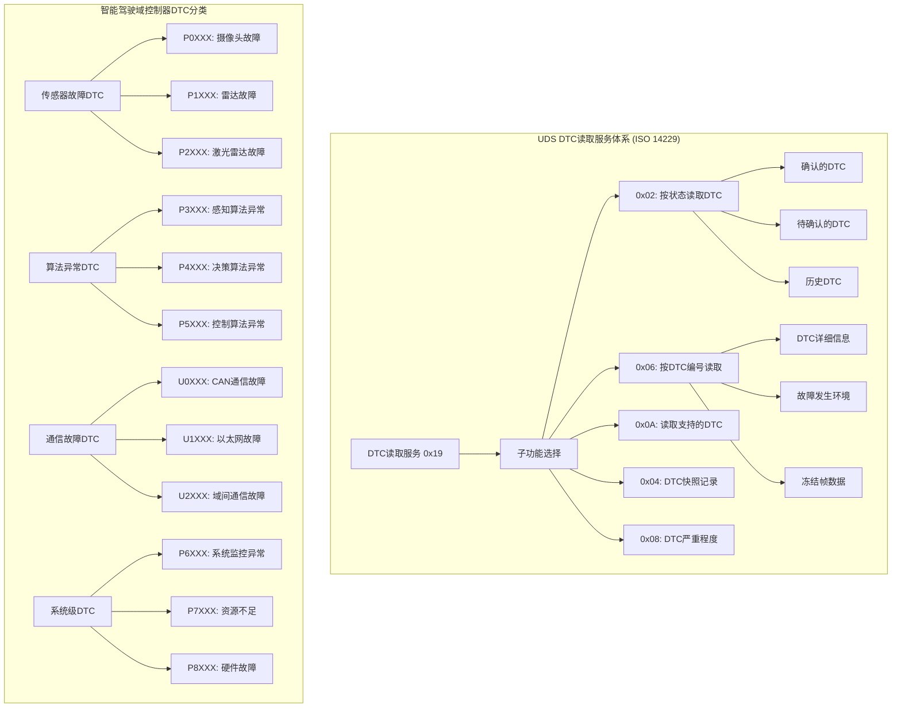

#### 2.3.2 完整诊断流程示例

下图展示了智能驾驶域控制器的典型诊断流程，从建立扩展诊断会话开始，通过TesterPresent保持连接，依次进行系统信息读取、故障码诊断、实时数据获取和传感器自检，最后通过硬复位结束诊断流程。

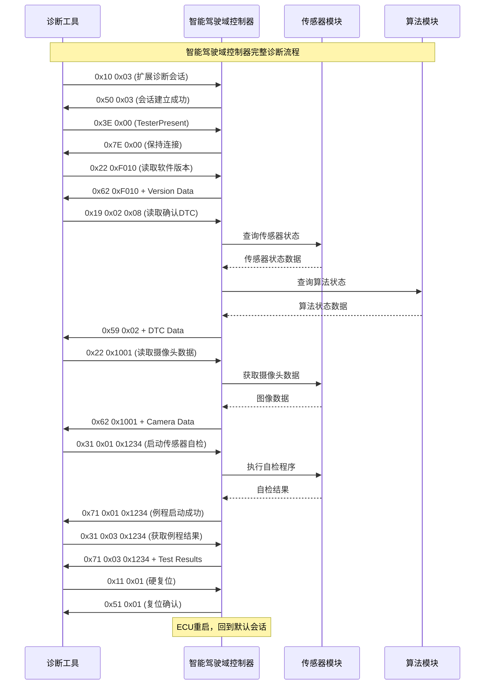

### 2.4 远程例程控制服务

#### 2.4.1 例程控制 (SID: 0x31)

下图展示了UDS例程控制服务的三种子功能及其在智能驾驶域控制器中的具体应用。例程控制允许远程启动复杂的测试序列，从传感器标定到算法性能测试，再到系统级自检程序的全面覆盖。

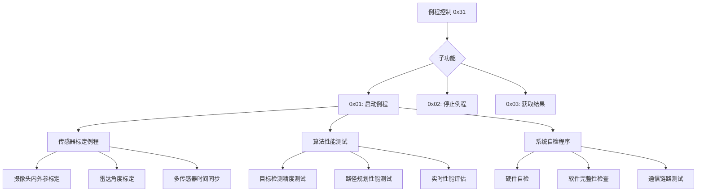

## 三、UDS在智能驾驶域控制器全生命周期中的应用

### 3.1 开发阶段应用

下图展示了智能驾驶域控制器在产品开发各阶段中UDS协议的具体应用，从需求分析阶段的UDS服务定义，到性能优化阶段的诊断功能调优，UDS贯穿整个开发生命周期。

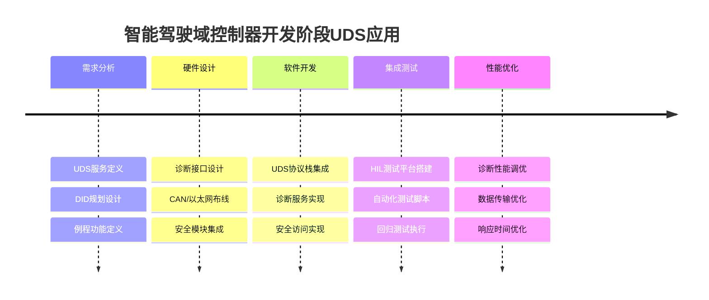

### 3.2 生产制造阶段

下图展示了生产线上UDS协议在EOL（End of Line）下线检测中的完整应用流程，从固件刷写到最终的故障注入测试，确保每台域控制器出厂前的功能完整性和质量可靠性。

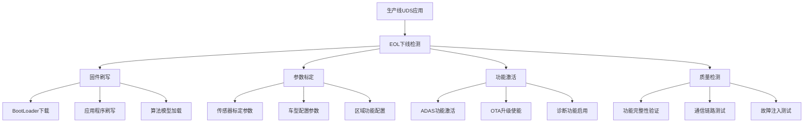

### 3.3 售后服务阶段

下图展示了售后服务中UDS协议的两大应用场景：传统的车辆进厂诊断流程和现代的远程OTA升级服务。左侧显示了从故障检测到维修验证的完整售后诊断链条，右侧展示了从安全认证到系统验证的OTA升级全流程。

```mermaid
graph TB
    subgraph "售后诊断服务体系"
        A[车辆进厂诊断] --> B[UDS连接建立]
        B --> C[系统状态检查]
        C --> D[故障码读取分析]
        D --> E[深度故障定位]
        E --> F[维修方案制定]
        F --> G[维修执行]
        G --> H[维修验证]
        H --> I[故障码清除]
    end
    
    subgraph "远程OTA升级"
        J[OTA升级请求] --> K[安全认证]
        K --> L[编程会话建立]
        L --> M[固件下载传输]
        M --> N[固件完整性验证]
        N --> O[固件刷写执行]
        O --> P[系统重启验证]
    end
```

## 四、UDS协议实施的技术要点与注意事项

### 4.1 功能安全考虑

在智能驾驶域控制器中实施UDS协议时，必须考虑功能安全要求：

下图展示了UDS功能安全设计的四个核心维度，从诊断通信的完整性保护，到安全访问的多重控制，再到故障检测的实时监控和安全状态的动态管理，构建了完整的UDS安全防护体系。

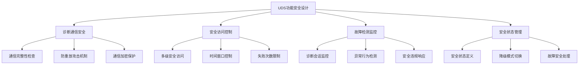

### 4.2 性能优化策略

下图以思维导图的形式展示了UDS性能优化的四大策略领域，涵盖通信效率提升、响应时间优化、系统资源管理和错误处理机制的全面优化方案。

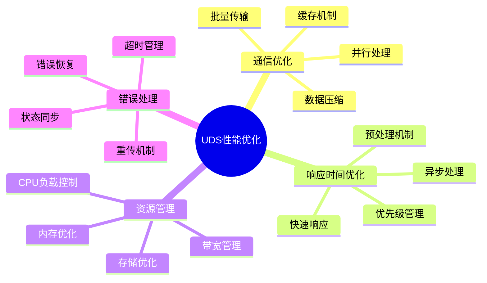

### 4.3 标准化与兼容性

下图展示了UDS协议标准化实施的四个关键维度，从严格遵循ISO 14229国际标准，到满足OEM厂商的特殊需求，再到确保主流诊断工具的兼容性和未来技术的可扩展性。

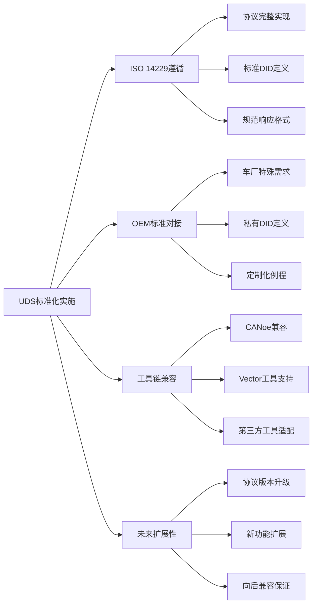

## 五、总结与展望

UDS协议作为智能驾驶域控制器的"数字神经系统"，在整个产品生命周期中发挥着关键作用：

### 5.1 核心价值总结

1. **标准化诊断接口**：提供统一的诊断通信标准，降低开发和维护成本
2. **深度故障诊断**：支持从系统级到算法级的全方位故障诊断
3. **高效数据交互**：实现实时数据读取、参数配置和远程控制
4. **安全可靠通信**：内置安全机制，保障诊断通信的安全性
5. **全生命周期支持**：覆盖开发、生产、售后的完整应用场景

### 5.2 未来发展趋势

下图以时间线的形式展示了UDS协议在智能驾驶领域的发展演进路径，从当前基于CAN的传统应用，逐步向5G网络、AI辅助和数字孪生等前沿技术领域扩展。

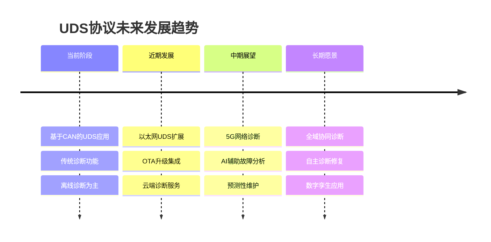

随着智能驾驶技术的不断发展，UDS协议也将持续演进，为更复杂的域控制器系统提供更强大的诊断和通信能力。掌握UDS协议的深度应用，将是智能驾驶系统工程师的核心竞争力之一。

---

*本文从智能驾驶域控制器的实际应用角度深度解析了UDS协议，旨在为相关工程师和研发人员提供实用的技术指导。随着智能驾驶技术的快速发展，UDS协议的应用场景和技术要求也将不断升级，需要我们持续关注和学习。*
